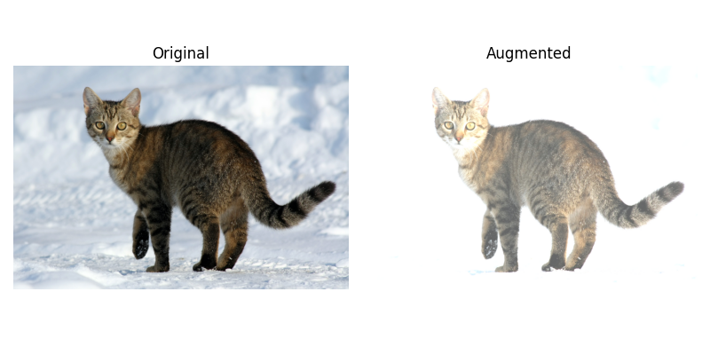
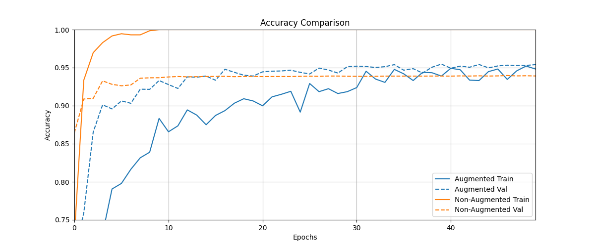

# 🎨 Image Data Augmentation with TensorFlow

<div align="center">


**Enhancing MNIST Classification through Smart Data Augmentation**

[Overview](#-overview) • [Features](#-features) • [Results](#-results) • [Installation](#-installation) • [Usage](#-usage)

</div>

---

## 🎯 Overview

This project demonstrates the **power of image data augmentation** in improving model generalization and reducing overfitting. Using TensorFlow's powerful image augmentation APIs, we apply multiple transformations dynamically during model training on the classic MNIST handwritten digits dataset.

### Key Highlights

- ✨ Real-time augmentation using `tf.data` pipelines
- 🚀 Improved validation accuracy from **~94%** to **~95%**
- 🔄 Multiple augmentation techniques combined
- 📊 Comprehensive visualization of results

---

## 🛠️ Features

### Augmentation Techniques

Our pipeline implements the following transformations on-the-fly:

| Technique | Description |
|-----------|-------------|
| 🔄 **Horizontal Flipping** | Mirrors images horizontally |
| ⚫ **Grayscale Conversion** | Converts to single-channel representation |
| 💡 **Brightness Adjustment** | Randomly adjusts image brightness |
| 🌈 **Saturation Adjustment** | Modifies color intensity |
| 🔃 **Rotation** | Rotates images at various angles |
| ✂️ **Random Cropping** | Crops with padding for variety |
| 🎲 **Random Brightness** | Stochastic brightness changes |

All augmentations are applied **dynamically** during training using efficient `tf.data` pipelines for optimal performance.

---

## 📊 Results

### Performance Comparison

| Model Configuration | Validation Accuracy | Improvement |
|---------------------|---------------------|-------------|
| ❌ Without Augmentation | ~94% | Baseline |
| ✅ With Augmentation | **~95%** | **+1%** |

> **Note:** Data augmentation successfully improved generalization and reduced overfitting, though convergence was slightly slower due to increased data diversity.

### Visual Results

#### Augmentation Examples


*Various augmentation techniques applied to MNIST digits*

#### Accuracy Comparison


*Training and validation accuracy with and without augmentation*

---

## 📦 Dataset

**MNIST Handwritten Digits**

- 📝 Training subset: **2,048 samples**
- ✅ Validation: **Full test set** (10,000 samples)
- 🖼️ Image size: 28×28 grayscale
- 🔢 Classes: 10 (digits 0-9)

---

## 🏗️ Model Architecture

### Fully Connected Neural Network

```
Input Layer (784 neurons)
    ↓
Dense Layer (4096 units, ReLU)
    ↓
Dense Layer (4096 units, ReLU)
    ↓
Output Layer (10 units, Softmax)
```

**Training Configuration:**
- 🎯 Optimizer: **Adam**
- 📉 Loss: **Sparse Categorical Crossentropy**
- 🔄 Activation: **ReLU** (hidden layers)
- 📊 Metrics: **Accuracy**

---

## 🚀 Installation

### Prerequisites

- Python 3.7+
- pip package manager

### Setup

1. **Clone the repository**
   ```bash
   git clone https://github.com/yourusername/mnist-augmentation.git
   cd mnist-augmentation
   ```

2. **Install dependencies**
   ```bash
   pip install -r requirements.txt
   ```

### Dependencies

```txt
tensorflow>=2.8.0
numpy>=1.21.0
matplotlib>=3.4.0
```

---

## 💻 Usage

### Training the Model

Run the training script with augmentation:

```bash
python src/train.py
```

### Configuration Options

Customize augmentation parameters in `src/config.py`:

```python
AUGMENTATION_CONFIG = {
    'flip_horizontal': True,
    'rotation_range': 15,
    'brightness_delta': 0.2,
    'saturation_range': (0.8, 1.2)
}
```

### Project Structure

```
mnist-augmentation/
├── src/
│   ├── train.py          # Main training script
│   ├── augmentation.py   # Augmentation functions
│   └── model.py          # Model architecture
├── results/
│   ├── augmentation_examples.png
│   └── accuracy_comparison.png
├── requirements.txt
└── README.md
```

---

## 📈 Key Insights

1. **Improved Generalization**: Augmentation reduced overfitting by exposing the model to more diverse training samples
2. **Trade-off**: Slightly slower convergence due to increased data complexity
3. **Efficiency**: On-the-fly augmentation using `tf.data` maintains training speed
4. **Robustness**: Model becomes more robust to variations in test data

---

## 🤝 Contributing

Contributions are welcome! Feel free to:

- 🐛 Report bugs
- 💡 Suggest new augmentation techniques
- 🔧 Submit pull requests
- ⭐ Star this repository

---


---

## 🙏 Acknowledgments

- TensorFlow team for excellent documentation
- MNIST dataset creators
- Open source community

---

<div align="center">

**Made with ❤️ and TensorFlow**

[⬆ Back to Top](#-image-data-augmentation-with-tensorflow)

</div>
